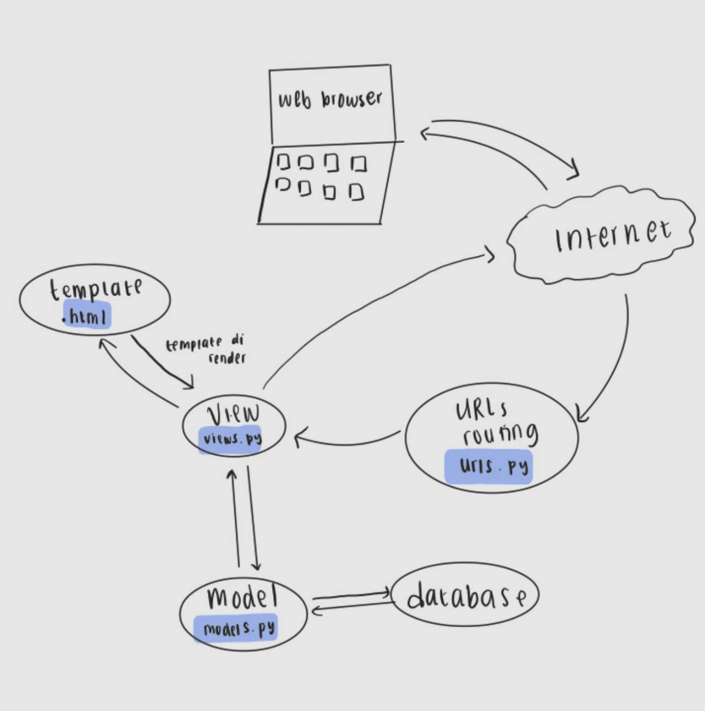
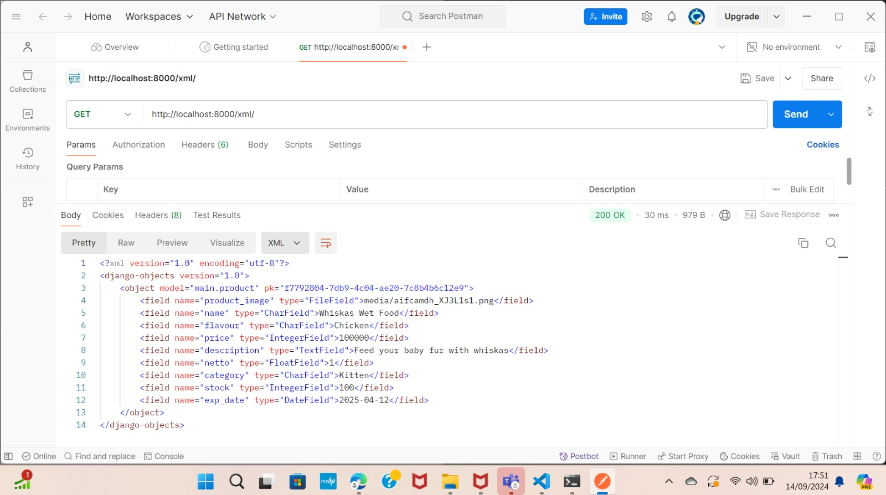
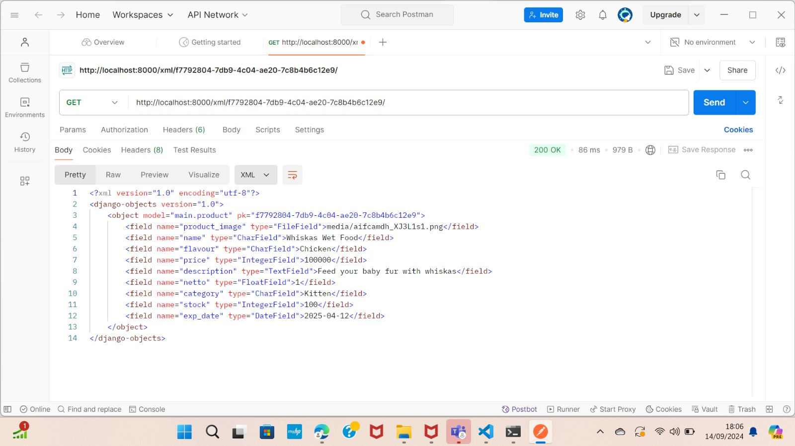

Link PWS : http://raisa-sakila-raisapetshop2.pbp.cs.ui.ac.id/


# Tugas 2

<details>

# Jelaskan bagaimana cara kamu mengimplementasikan checklist di atas secara step-by-step

1. Membuat Direktori Proyek Lokal dan Inisialisasi Git
Langkah pertama dalam memulai proyek Django baru adalah membuat sebuah direktori lokal yang akan menjadi tempat kerja utama proyek ini. Karena proyek ini akan dipush ke Git untuk kontrol versi dan kolaborasi, saya memulai dengan menginisialisasi Git pada direktori proyek menggunakan perintah `git init`. Inisialisasi ini penting untuk melacak perubahan kode selama pengembangan.

2. membuat virtual environment
Membuat virtual environment sebelum memulai proyek Django merupakan langkah penting. Langkah ini memastikan proyek dapat berjalan di lingkungan yang terpisah. Dengan adanya virtual environment, proyek yang melibatkan kolaborasi antar developer dapat terhindar dari potensi konflik yang disebabkan oleh perbedaan konfigurasi perangkat. Pengaktifan dilakukan dengan perintah `env\Scripts\activate`


3. Membuat dan Mengelola `requirements.txt`
Setelah Git diinisialisasi dan aktivasi environment, saya membuat file `requirements.txt` di dalam direktori proyek. File ini berisi daftar dependencies (pustaka perangkat lunak) yang diperlukan untuk menjalankan proyek. Contohnya, Django dan pustaka tambahan seperti `gunicorn`. Dengan file ini, dependencies dapat diinstal otomatis menggunakan perintah `pip install -r requirements.txt`.

4. Membuat Struktur Proyek Django
Setelah dependencies terpasang, saya membuat struktur dasar proyek Django dengan menjalankan perintah:
django-admin startproject raisa_petshop .
Perintah ini membuat proyek bernama `raisa_petshop` dalam direktori yang sedang saya gunakan. Dalam folder ini terdapat beberapa file penting seperti `settings.py`, `urls.py`, `asgi.py`, dan `wsgi.py`, yang berfungsi untuk mengonfigurasi proyek baik di lingkungan lokal maupun hosting.

5. Membuat Aplikasi Pertama: `main`
Langkah berikutnya adalah membuat aplikasi pertama dalam proyek ini dengan nama `main`. Saya menggunakan perintah:
python manage.py startapp main
Perintah ini membuat folder `main` yang berisi file-file penting seperti `models.py`, `views.py`, dan `admin.py`. Untuk mengenalkan aplikasi ini ke proyek utama, saya menambahkan `main` ke dalam daftar `INSTALLED_APPS` di file `settings.py`.

6. Mengembangkan Komponen Aplikasi
Di dalam folder `main`, saya mulai mengembangkan beberapa komponen inti:
- `models.py`: Digunakan untuk mendefinisikan struktur data dan tabel yang akan disimpan dalam database.
- `views.py`: Mengelola logika aplikasi dan bagaimana data akan disajikan ke pengguna.
- `urls.py`: Digunakan untuk mengatur routing URL yang menghubungkan permintaan pengguna dengan fungsi-fungsi di `views.py`.

7. Penerapan Konsep MVT (Model, View, Template)
Untuk mengikuti arsitektur MVT, saya menambahkan folder `templates` di dalam aplikasi `main` untuk menyimpan file HTML yang akan merender halaman web. Dalam konsep MVT:
- Model untuk mengelola data dan interaksi dengan database.
- View memproses permintaan dan mengambil data dari model.
- Template menampilkan data kepada pengguna dalam bentuk halaman HTML.

Sebagai contoh, dalam `models.py`, saya mendefinisikan model untuk produk di pet shop. Sementara itu, di `views.py`, saya membuat fungsi `show_main` yang mengelola data dari model dan mengirimkan data tersebut ke template HTML.

8. Menambahkan URL Routing
Setelah membuat fungsi di `views.py`, saya membuat file `urls.py` di dalam folder `main` untuk menentukan pola URL yang akan digunakan untuk memanggil fungsi tersebut. Dengan cara ini, pengguna dapat mengakses halaman utama aplikasi dengan URL yang sudah ditentukan.

9. Deployment ke Pacil Web Services (PWS)
Setelah proses developeran selesai, langkah terakhir adalah melakukan deployment ke Pacil Web Services (PWS). Berikut adalah langkah-langkahnya:
   1. Login ke PWS: Saya membuka situs PWS dan login dengan username serta password.
   2. Membuat Proyek Baru: Saya memilih opsi 'Create New Project' untuk menambahkan proyek baru ke PWS. Pada tahap ini, saya menerima kredensial proyek.
   3. Konfigurasi `ALLOWED_HOSTS`: Saya menambahkan URL deployment PWS ke daftar `ALLOWED_HOSTS` di file `settings.py`.
   4. Push ke GitHub: Saya melakukan `git add`, `commit`, dan `push` ke GitHub.
   5. Push ke PWS: Saya menambahkan PWS sebagai remote repository dan melakukan push dengan menjadikan direktori utama proyek sebagai branch.
   6. Build Proyek: Setelah proses build berhasil, aplikasi saya bisa diakses publik melalui URL berikut: [http://raisa-sakila-raisapetshop2.pbp.cs.ui.ac.id/](http://raisa-sakila-raisapetshop2.pbp.cs.ui.ac.id/).

10. Membuat README.md
setelah melakukan deployment, saya membuat file README.md di direkori utama. File ini bertujuan untuk menuliskan jawaban jawaban saya mengenai pertanyaan pertanyaan yang terdapat pada tugas 2. setelah itu saya melakukan commit dan push ke akun github 

# Buatlah bagan yang berisi request client ke web aplikasi berbasis Django beserta responnya dan jelaskan pada bagan tersebut kaitan antara urls.py, views.py, models.py, dan berkas html


# Alur Request

1. Client mengirimkan request HTTP ke server. Kemudian, urls.py mencocokkan URL request dengan pola yang ada dan menentukan fungsi view yang akan menangani request. Selanjutnya views.py memproses request. views.py merupakan fungsi yang berinteraksi dengan models.py untuk mengambil atau memanipulasi data. Setelah itu, models.py melakukan query ke database dan mengembalikan data sesuai dengan atribut yang didefinisikan di models.py ke views.py. Setelah menerima data, views.py memilih HTML file (template) untuk merender data. Terakhir, HTML file dirender dan dikembalikan sebagai response ke Client.

1. urls.py:
   urls.py Mengatur pola URL (URL patterns) dan menghubungkan URL yang diminta oleh client dengan fungsi view yang sesuai. Ketika client mengirimkan request ke server, Django akan mencocokkan URL request dengan pola URL yang didefinisikan dalam `urls.py`. Jika ditemukan kecocokan, Django akan memanggil fungsi view yang terkait.

2. views.py:
   views.py menangani logika aplikasi dan memproses data yang diterima dari request. Fungsi di dalam `views.py` akan menghasilkan response berdasarkan data yang diproses. Fungsi view akan berinteraksi dengan model untuk mengambil atau memanipulasi data dan kemudian memilih template HTML untuk dirender.

3. models.py:
   models.py mendefinisikan struktur data dan interaksi dengan database. Model merupakan representasi dari tabel dalam database. Ketika fungsi view memerlukan data dari database, model digunakan untuk membuat query dan mengambil data yang diperlukan. lalu mengirimkannya kembali ke views.py

4. HTML File:
   HTML file merupakan template yang digunakan untuk menyajikan data ke client. Template HTML berisi markup yang akan dirender sebagai halaman web. Fungsi view memilih template HTML untuk digunakan, kemudian mengisi template tersebut dengan data yang diambil dari model, dan mengembalikannya sebagai response HTML kepada client.

sumber : ppt PBP

# Jelaskan fungsi git dalam pengembangan perangkat lunak!
1. Sistem Kontrol Versi 
sumber : (https://dcloud.co.id/blog/apa-itu-git.html)
Git adalah sistem kontrol versi terdistribusi yang sangat penting dalam pengembangan perangkat lunak modern. Setiap perubahan yang dilakukan pada kode dicatat secara detail, termasuk informasi tentang siapa yang melakukan perubahan, kapan perubahan itu terjadi, dan alasan perubahan tersebut. Dengan fitur ini, Git memiliki catatan lengkap dari seluruh perkembangan proyek sehingga menjadi alat yang efektif dalam melacak dan mengelola kode.

2. Kemudahan dalam Melacak Perubahan dan Kembali ke Versi Sebelumnya
Git memudahkan developer untuk melacak seluruh sejarah proyek, sehingga jika ada masalah atau bug yang muncul, developer dapat dengan cepat meninjau perubahan sebelumnya dan kembali ke versi yang lebih stabil. Hal Ini sangat berguna dalam skenario pengembangan perangkat lunak yang kompleks, di mana perubahan kecil bisa menyebabkan bug kritis. Dengan kemampuan Git untuk mengelola versi sebelumnya, developer bisa dengan cepat memperbaiki masalah tanpa harus kehilangan versi terbaru yang telah dicapai.

3. Branching: Fitur untuk pengembangan Paralel
sumber : (https://dcloud.co.id/blog/apa-itu-git.html)
Salah satu fitur paling kuat dari Git adalah branching. Dengan branching, developer dapat membuat cabang terpisah untuk mengerjakan fitur baru atau memperbaiki bug tanpa mengganggu alur kerja utama. Setiap developer dapat membuat cabang sendiri dan bekerja secara independen. Hal ini memberikan kemudahan bagi tim untuk bekerja secara paralel pada berbagai fitur atau tugas yang berbeda tanpa harus khawatir akan mengganggu pekerjaan orang lain. Branching juga memfasilitasi eksperimen karena perubahan dapat diisolasi dan diuji secara terpisah sebelum digabungkan kembali ke proyek utama.

4. Merging: Menggabungkan Perubahan Kode
Setelah developeran atau perbaikan pada cabang selesai, perubahan tersebut dapat digabungkan kembali ke cabang utama melalui proses yang disebut merging. Git menyediakan mekanisme untuk mengelola konflik yang mungkin muncul selama penggabungan, sehingga developer dapat mengintegrasikan pekerjaan mereka dengan mudah dan tanpa kehilangan perubahan penting. Dengan fitur ini, Git memfasilitasi integrasi yang lancar antaranggota tim, bahkan jika mereka bekerja secara independen pada bagian proyek yang berbeda.

5. Meningkatkan Kolaborasi Tim dalam Pengembangan Perangkat Lunak
sumber : (https://www.jagoanhosting.com/blog/git-adalah/)
Git tidak hanya mempermudah pengelolaan kode secara individu tetapi juga sangat mendukung kolaborasi dalam tim. Setiap anggota tim dapat bekerja pada cabang terpisah dan melakukan perubahan tanpa risiko merusak kode orang lain. Dengan kemampuan Git untuk menggabungkan perubahan dari beberapa developer secara efisien, tim dapat bekerja lebih produktif dan paralel. Hal ini membuat Git menjadi alat yang ideal untuk proyek besar dengan banyak developer yang bekerja pada bagian kode yang berbeda.

6. Git sebagai Perangkat Lunak Open-Source dengan Dukungan Komunitas Global
sumber : (https://www.jagoanhosting.com/blog/git-adalah/)
Git adalah perangkat lunak open-source, yang berarti siapa pun dapat menggunakannya secara gratis dan berkontribusi pada pengembangannya. Sebagai proyek open-source, Git didukung oleh komunitas global yang besar dan aktif. Komunitas ini menyediakan berbagai sumber daya seperti dokumentasi, tutorial, dan forum diskusi untuk membantu pengguna baru belajar dan memahami Git. Dukungan komunitas yang luas ini memudahkan developer untuk mendapatkan bantuan kapan pun mereka menemui masalah atau butuh panduan dalam mengimplementasikan fitur Git yang lebih canggih.


# Menurut Anda, dari semua framework yang ada, mengapa framework Django dijadikan permulaan pembelajaran pengembangan perangkat lunak?
1. Django Menggunakan Bahasa Pemrograman Python
Django dibangun dengan Python, yang merupakan salah satu bahasa pemrograman paling populer di dunia. Python dikenal karena sintaksnya yang sederhana dan mirip dengan bahasa sehari-hari. Hal ini membuat bahasa ini mudah dipelajari oleh pemula yang baru terjun ke dunia pemrograman. Django mewarisi karakteristik Python ini, sehingga developer dapat menulis kode dengan cepat tanpa terlalu banyak aturan sintaks yang rumit. Hal ini membantu pemula memusatkan perhatian pada konsep-konsep inti pengembangan perangkat lunak, seperti pola arsitektur MVT (Model-View-Template) yang digunakan oleh Django. Selain itu, Python memiliki banyak pustaka yang dapat dengan mudah diintegrasikan ke Django. Misalnya, pustaka untuk manipulasi data, pengujian, atau keamanan. Hal ini mempercepat proses pembelajaran dan pengembangan.

2. Django Memiliki Komunitas yang Luas
Salah satu alasan utama Django sering dipilih untuk pembelajaran pengembangan perangkat lunak adalah karena dukungan komunitas yang luas. Django memiliki dokumentasi resmi yang sangat baik, yang menyediakan panduan langkah demi langkah mulai dari instalasi hingga fitur lanjutan. Hal ini sangat membantu pemula memahami konsep pengembangan web dengan mudah. Ditambah lagi, ada banyak forum, blog, serta komunitas online (seperti StackOverflow) yang didedikasikan untuk Django. Jika pemula mengalami kesulitan, mereka dapat dengan cepat menemukan jawaban atau meminta bantuan dari komunitas Banyak tutorial dan proyek Django open-source yang tersedia untuk dipelajari. Pemula dapat mempelajari proyek nyata, memahami alur kerja profesional, dan mencoba mengimplementasikan fitur serupa pada proyek mereka sendiri.

3. Proses Development Django yang Sederhana
Django dirancang untuk mempermudah pengembangan aplikasi web, terutama bagi pemula. Django mengikuti prinsip “batteries included” yang berarti framework ini hadir dengan berbagai fitur built-in yang siap digunakan tanpa memerlukan konfigurasi manual yang rumit. Misalnya, Django sudah menyediakan sistem otentikasi pengguna, admin panel, manajemen database, dan lain-lain. Django membuat pengembangan aplikasi web berjalan cepat berkat alat seperti ORM (Object-Relational Mapping) untuk manajemen database, routing otomatis untuk URL, serta template engine yang mudah digunakan. Pemula dapat dengan cepat membuat aplikasi web fungsional tanpa harus menulis banyak kode dari nol. Django cocok untuk proyek kecil maupun besar. Meskipun pemula mungkin memulai dengan proyek sederhana, Django bisa diandalkan saat proyek tersebut tumbuh menjadi aplikasi besar. Fitur seperti caching, middlewares, dan kemampuan untuk mendukung berbagai jenis database membuatnya fleksibel untuk proyek dengan berbagai skala.

# Mengapa model pada Django disebut sebagai ORM?
sumber : (https://rumahcoding.co.id/pengantar-django-orm-memahami-dan-menggunakan-model-dalam-django/#:~:text=Apa%20itu%20Django%20ORM%3F%20Django%20ORM%20%28Object-Relational%20Mapping%29,objek%20Python%2C%20tanpa%20perlu%20menulis%20kueri%20SQL%20langsung.)

Model pada Django disebut sebagai ORM (Object-Relational Mapping) karena menyediakan cara untuk memetakan objek Python ke dalam struktur basis data relasional. Dengan menggunakan Django ORM, developer dapat mendefinisikan model sebagai kelas Python, di mana atribut kelas mewakili kolom dalam tabel database dan setiap instance model merepresentasikan baris dalam tabel tersebut. Django ORM menyederhanakan interaksi dengan basis data dengan menghilangkan kebutuhan untuk menulis query SQL secara langsung. Developer dapat melakukan operasi database menggunakan metode objek Python, dan ORM secara otomatis mengonversi operasi tersebut menjadi query SQL yang sesuai.

</details>

# Tugas 3

<details>

#  Jelaskan mengapa kita memerlukan data delivery dalam pengimplementasian sebuah platform?

Proses pengembangan sebuah platform biasanya melibatkan beberapa lapisan atau komponen, seperti frontend, backend, dan database. Setiap komponen memiliki peran penting dalam pengembangan dan operasional platform. Agar platform dapat berfungsi secara efektif, data harus dapat dikirimkan dari satu stack ke stack lainnya dengan lancar. Di sinilah data delivery memainkan peran penting. Sebagai contoh, data yang diinput oleh pengguna melalui frontend harus dikirim ke backend untuk diproses, kemudian hasilnya disimpan atau diambil dari database sebelum dikirim kembali ke frontend untuk ditampilkan kepada pengguna. Tanpa mekanisme data delivery yang efisien, komunikasi antar komponen akan terganggu. Hal ini akan menyebabkan platform tidak berfungsi optimal, menjadi lambat, atau bahkan gagal dalam memenuhi kebutuhan pengguna.

#  Menurutmu, mana yang lebih baik antara XML dan JSON? Mengapa JSON lebih populer dibandingkan XML?
Berdasarkan tutorial yang saya lakukan, menurut saya sebagai pemula di platform based programming, JSON lebih baik dari segi keterbacaan kode. JSON lebih baik daripada XML karena memiliki sintaks yang lebih sederhana dan mudah dibaca. JSON menggunakan struktur yang lebih ringkas, dengan pasangan key-value yang jelas sehingga lebih mudah dipahami oleh manusia. Ditambah lagi, berdasarkan informasi yang saya baca dari sumber, kompatibilitas JSON diterima secara luas oleh web ataupun perangkat seluler karena JSON secara langsung didukung oleh JavaScript yang merupakan bahasa pemrograman utama di banyak aplikasi web. Selain itu, JSON dapat dengan mudah di-parse dan diolah oleh banyak bahasa pemrograman lainnya, termasuk Python, Java, dan C#. Hal ini mendukung penggunaannya di berbagai platform teknologi modern. JSON lebih populer dibandingkan XML karena beberapa alasan, yaitu : 

1. **Sintaks yang Lebih Sederhana**: JSON memiliki sintaks yang jauh lebih ringkas dibandingkan XML. JSON menggunakan key-value tanpa tag pembuka dan penutup yang berlebihan seperti XML. Hal ini menunjukan bahwa JSON lebih mudah dibaca dan ditulis oleh manusia serta lebih mudah dipahami oleh mesin.

2. **Ukuran Lebih Kecil**: Karena JSON tidak memerlukan tag penutup untuk setiap elemen, data yang ditransmisikan dalam format JSON biasanya lebih kecil dibandingkan XML. Hal tersebut akan mengurangi overhead data dan mempercepat proses pengiriman dan penerimaan data yang sangat penting dalam aplikasi web dan seluler.

3. **Kompatibilitas dengan JavaScript**: JSON pada dasarnya cocok dengan JavaScript, yaitu bahasa yang dominan dalam pengembangan web. JavaScript dapat dengan mudah mengonversi data JSON ke dalam objek yang dapat langsung digunakan tanpa parsing tambahan. Di sisi lain, XML memerlukan proses parsing yang lebih rumit. 

4. **Penggunaan di API Modern**: JSON menjadi format pilihan untuk RESTful API yang saat ini menjadi standar dalam pertukaran data antara server dan aplikasi klien. XML lebih umum digunakan pada SOAP, yang kini dianggap lebih rumit dan tidak seefisien JSON untuk aplikasi web modern.

5. **Dukungan Multiplatform**: JSON diterima dan diolah dengan baik oleh berbagai bahasa pemrograman seperti Python, Ruby, Go, C#, dan Java, sehingga lebih fleksibel dalam pengembangan lintas platform dibandingkan XML. 

6. **Parsing Lebih Cepat**: Struktur JSON yang lebih sederhana membuat proses parsing menjadi lebih cepat dan ringan dibandingkan dengan XML, yang memerlukan parser khusus yang lebih kompleks.

[sumber : https://appmaster.io/id/blog/json-vs-xml-id dan ChatGPT]

# Jelaskan fungsi dari method is_valid() pada form Django dan mengapa kita membutuhkan method tersebut?
Method `is_valid()` pada form Django berfungsi untuk memicu proses validasi data yang dimasukkan ke dalam form. Ketika `is_valid()` dipanggil, Django akan menjalankan serangkaian langkah validasi untuk setiap field di dalam form. Proses validasi ini melibatkan beberapa tahap, termasuk konversi data ke tipe yang benar menggunakan metode `to_python()`, validasi spesifik field menggunakan metode `validate()`, dan menjalankan validator menggunakan `run_validators()`.

Jika data yang dimasukkan valid, `is_valid()` akan mengembalikan nilai `True`, dan data yang telah dibersihkan (cleaned data) akan tersedia di atribut `cleaned_data` form. Namun, jika ada masalah dengan data, Django akan mengumpulkan semua error dan menyimpannya di atribut `errors` form, dan `is_valid()` akan mengembalikan `False`.

Metode ini penting karena memastikan bahwa data yang diterima oleh form benar dan dalam format yang diharapkan sebelum diproses lebih lanjut. Tanpa `is_valid()`, kita tidak akan bisa mengetahui apakah data yang dikirimkan oleh pengguna valid atau tidak, dan ini bisa menyebabkan error atau hasil yang tidak diinginkan dalam aplikasi.
Sumber : https://docs.djangoproject.com/en/5.1/ref/forms/validation/

# Mengapa kita membutuhkan csrf_token saat membuat form di Django? Apa yang dapat terjadi jika kita tidak menambahkan csrf_token pada form Django? Bagaimana hal tersebut dapat dimanfaatkan oleh penyerang?

Kita membutuhkan `csrf_token` saat membuat form di Django untuk melindungi aplikasi dari serangan **Cross-Site Request Forgery (CSRF)**, yaitu serangan di mana penyerang mencoba memanipulasi pengguna yang sudah terautentikasi agar melakukan tindakan tertentu tanpa sepengetahuannya, seperti mengirimkan formulir atau memodifikasi data penting.

Ketika kita tidak menambahkan `csrf_token` pada form, aplikasi menjadi rentan terhadap serangan CSRF. Penyerang bisa mengirimkan tautan atau formulir palsu kepada pengguna, dan karena pengguna sudah login di situs tersebut, tindakan berbahaya seperti transfer dana atau perubahan pengaturan akun bisa terjadi tanpa persetujuan mereka.

Dengan `csrf_token`, Django memastikan bahwa setiap permintaan yang dikirimkan oleh form harus disertai token unik yang hanya dimiliki oleh sesi pengguna yang sah. Token ini diverifikasi oleh server sebelum memproses permintaan. Jika token tidak valid atau tidak ada, Django menolak permintaan tersebut dengan kode error, biasanya **403 Forbidden** sehingga serangan CSRF dapat dicegah.

Tanpa `csrf_token`, penyerang bisa memanfaatkan kerentanan untuk melakukan aksi yang merugikan atas nama pengguna yang telah login.

sumber : https://www.geeksforgeeks.org/csrf-token-in-django/

# Jelaskan bagaimana cara kamu mengimplementasikan checklist di atas secara step-by-step (bukan hanya sekadar mengikuti tutorial).
1. Menambahakan UUID sebagai primary key
Berdasarkan ancaman yang dapat muncul dari IDOR (Insecure Direct Object References), primary key berjenis integer yang increment dapat dienumerasi oleh pihak ketiga sehingga UUID lebih aman karena tidak berurutan dan lebih sulit diprediksi. Dengan demikian, dalam tugas ini langkah pertama yang saya lakukan adalah mengubah primary key dari integer menjadi UUID. Perubaha tersebut diimplementasikan pada file models.py pada direkotori aplikasi. Hal tersebut dilakukan dengan cara mendefinisikan id pada models.py `id = models.UUIDField(primary_key=True, default=uuid.uuid4, editable=False)`. Karena terjadi perubahan pada files models.py, saya melakukan migration kembali dengan perintah `python manage.py makemigrations` kemudian `python manage.py migrate`

2. Membuat form input data
Langkah-langkah dalam proses ini dimulai dengan membuat form di file `forms.py` yang bertujuan untuk menghubungkan input dari pengguna dengan model database yang sudah dibuat. Form ini akan memastikan bahwa data yang diinput sesuai dengan field yang ada pada model dan membantu mempermudah proses input. Setelah form selesai dibuat saya menambahkan fungsi di `views.py` yang berfungsi untuk menangani permintaan dari pengguna, memvalidasi data yang diinput melalui form, serta menyimpan data tersebut ke dalam database. Fungsi ini juga mengelola respon setelah data berhasil disimpan, dengan melakukan redirect ke halaman lain. Selanjutnya, saya menambahkan konfigurasi routing di `urls.py` sehingga ini diakses melalui URL tertentu di aplikasi. Setelah routing selesai, saya membuat file template HTML pada folfer templates di direktori aplikasi `create_product.html` untuk menampilkan form input di browser disertai dengan mekanisme pengiriman data melalui metode POST. Template ini akan dihubungkan ke form yang telah dibuat di `forms.py` dan ditampilkan dalam format tabel yang rapi. Terakhir, modifikasi file template utama `main.html` agar dapat menampilkan data yang sudah diinput oleh pengguna. Data yang tersimpan akan ditampilkan dalam bentuk tabel di halaman utama, memudahkan pengguna untuk melihat daftar produk atau data lain yang telah dimasukkan.

3. Mengembalikan data dalam bentuk XML dan JSON

Langkah pertama dalam mengembalikan data dalam bentuk XML dan JSON adalah melakukan import terhadap `HttpResponse` dan `serializers`. Modul `HttpResponse` berfungsi untuk membuat objek respons yang mengandung data yang akan dikirim kembali ke klien setelah diproses, sedangkan `serializers` digunakan untuk mengonversi objek model menjadi format yang dapat dibaca dan ditransmisikan, seperti JSON atau XML. 

Dalam melakukan pengembalian data dalam bentuk xml, saya membuat fungsi baru pada views.py, yaitu `show_xml` yang menerima parameter request. Pada fungsi ini, saya membuat variabel data yang berisikan hasil query data yang ada di model product dengan perintah `Product.objects.all()`. Selanjutnya, saya menambahkan return function untuk mengembalikan data hasil query tersebut setelah diserialisasi menjadi format JSON dengan penggunaan serializers. Kemidan saya mengatur `content_type` menjadi `"application/xml"` pada `HttpResponse` untuk memastikan bahwa data dikembalikan dalam format JSON. Setelah itu, pada `urls.py` direktori aplikasi saya melakukan impor fungsi `show_xml` yang baru saja dibuat. Kemudian, saya menambahkan path URL untuk fungsi tersebut ke dalam daftar `urlpatterns` agar pengguna dapat mengaksesnya.

Untuk mengembalikan data dalam format JSON, cara yang dilakukan tidak terlalu berbeda dengan pengembalian data dalam bentuk XML. Saya membuka file `views.py` yang ada pada direktori `main/`, kemudian membuat fungsi baru bernama `show_json` yang menerima parameter `request`. Di dalam fungsi ini, saya membuat variabel `data` yang menyimpan hasil query dari semua data yang ada di model `Product` dengan menggunakan `Product.objects.all()`. Selanjutnya, saya menambahkan return function untuk mengembalikan data hasil query tersebut setelah diserialisasi menjadi format JSON. Saya menggunakan`serializers.serialize()` untuk melakukan serialisasi data dan atur `content_type` menjadi `"application/json"` pada `HttpResponse` untuk memastikan bahwa data dikembalikan dalam format JSON. Setelah itu, pada `urls.py` direktori aplikasi saya melakukan impor fungsi `show_json` yang baru saja dibuat. Kemudian, saya menambahkan path URL untuk fungsi tersebut ke dalam daftar `urlpatterns` agar pengguna dapat mengaksesnya.

4. Mengembalikan Data Berdasarkan ID dalam Bentuk XML dan JSON
Untuk mengembalikan data berdasarkan ID dalam format XML dan JSON, langkah pertama yang saya lakukan adalah menambahkan dua fungsi baru pasa views.py, yaitu show_xml_by_id dan show_json_by_id. Kedua fungsi ini akan menerima dua parameter, yaitu request dan id. Di dalam fungsi tersebut. Kemudian saya membuat variabel bernama data yang akan menyimpan hasil query dari data dengan ID tertentu yang ada di model MoodEntry. Query ini dilakukan dengan menggunakan metode filter(pk=id) untuk mencari objek dengan primary key (ID) yang sesuai.

Untuk mengembalikan data dalam format XML, saya menggunakan serializers.serialize() dengan parameter "xml" untuk mengonversi data menjadi XML, dan tambahkan HttpResponse yang berisi data hasil query yang telah diserialisasi. Saya melakukan pengaturan terhadap content_type ke "application/xml" agar data diidentifikasi sebagai XML ketika dikembalikan.

Untuk mengembalikan data dalam format JSON, caranya hampir sama. Bedanya, parameter pertama pada serializers.serialize() harus diubah menjadi "json", dan content_type harus disetting ke "application/json".

Setelah itu, saya melakukan import kedua fungsi tersebut pada `urls.py` lalu menambahkan path URL untuk masing-masing fungsi ke dalam variabel urlpatterns. Hal ini akan membuat pengguna dapat mengakses data berdasarkan ID melalui URL yang sesuai.

# Akses keempat URL di poin 2 menggunakan Postman





</details>

# Tugas 4

<details>

# Apa perbedaan antara HttpResponseRedirect() dan redirect()
`HttpResponseRedirect` dan `redirect()` dalam Django memiliki perbedaan utama dalam fungsi dan kemudahan penggunaan. `HttpResponseRedirect` adalah subclass dari `HttpResponse` yang digunakan untuk melakukan redirect ke URL tertentu, di mana URL harus ditentukan secara eksplisit. Contohnya, `HttpResponseRedirect('/some/url/')` memerlukan penulisan manual URL, yang dapat meningkatkan risiko kesalahan. Di sisi lain, `redirect()` adalah fungsi yang lebih fleksibel karena fungsi ini dapat menerima model, nama tampilan, atau URL, dan akan menggunakan `reverse()` untuk menemukan URL yang sesuai berdasarkan nama tampilan. Ini membuat `redirect()` lebih mudah dan lebih bersih, seperti pada penggunaan `redirect('some-view-name', arg1='value1')`. `HttpResponseRedirect` tidak mendukung pengalihan berdasarkan model, sedangkan `redirect()` dapat menerima objek model dan secara otomatis memanggil metode `get_absolute_url()` untuk mendapatkan URL yang sesuai. 

HttpResponseRedirect() memerlukan pemanggilan reverse() jika ingin menggunakan nama tampilan untuk mendapatkan URL, misalnya:
`response = HttpResponseRedirect(reverse('main:login'))`
redirect() dapat menerima berbagai jenis argumen, seperti nama tampilan, objek model, atau URL hardcoded. 
`return redirect('main:login')`
Secara otomatis menangani pemanggilan reverse() di dalamnya jika nama tampilan diberikan.

# Jelaskan cara kerja penghubungan model Product dengan User!
Dalam model Product, atribut yang merujuk ke User didefinisikan dengan menggunakan ForeignKey. Hal tesebut menunjukkan bahwa setiap produk terkait dengan satu pengguna (pemilik produk).
from django.db import models
from django.contrib.auth.models import User
class Product(models.Model):
    user = models.ForeignKey(User, on_delete=models.CASCADE)
    id = models.UUIDField(primary_key=True, default=uuid.uuid4, editable=False)
    product_image = models.ImageField(upload_to='media/')
   .....

Setiap kali produk dibuat, pengguna yang membuat produk tersebut diatur melalui atribut user. Dengan cara ini, setiap produk dapat dengan mudah dilacak dan dikelompokkan berdasarkan pemiliknya.
Jika pengguna dihapus (on_delete=models.CASCADE), maka semua produk yang terkait dengan pengguna tersebut juga akan dihapus.
Dalam views.py, dapat dengan mudah mengambil produk milik pengguna tertentu. 
`product_entries = Product.objects.filter(user=request.user)`
Dengan cara ini, penghubungan antara model Product dan User memudahkan pengelolaan dan pelacakan produk berdasarkan pemiliknya secara efisien dalam aplikasi Django.

# Apa perbedaan antara authentication dan authorization, apakah yang dilakukan saat pengguna login? Jelaskan bagaimana Django mengimplementasikan kedua konsep tersebut.
Autentikasi (Authentication)
Definisi: Autentikasi adalah proses untuk memverifikasi identitas pengguna. Dalam Django, proses autentikasi melibatkan pengecekan kredensial seperti username dan password untuk memastikan bahwa pengguna adalah siapa yang mereka klaim.
Cara Kerja di Django:
Pengguna memasukkan username dan password mereka.
Django memverifikasi kredensial tersebut menggunakan model User (django.contrib.auth.models.User).
Jika kredensial benar, Django mengizinkan akses ke sesi pengguna.
Autentikasi penting karena memastikan bahwa hanya pengguna yang sah yang dapat mengakses aplikasi atau sistem. Proses ini melindungi aplikasi dari akses tidak sah dan menjaga keamanan data.
Otorisasi (Authorization)
Definisi: Otorisasi adalah proses menentukan dan memberikan izin kepada pengguna yang sudah terautentikasi untuk mengakses atau melakukan tindakan tertentu dalam sistem. Proses otorisasi memastikan bahwa pengguna hanya dapat mengakses data dan fitur sesuai dengan hak akses yang diberikan.
Cara Kerja di Django:
Setelah pengguna terautentikasi, Django menggunakan mekanisme seperti grup, izin (permissions), dan level akses untuk menentukan apa yang dapat dilakukan oleh pengguna.
Django mengelola izin menggunakan model Group dan Permission, yang memungkinkan pengaturan akses ke berbagai bagian aplikasi.
Autentikasi penting karena memastikan bahwa hanya pengguna yang sah yang dapat mengakses aplikasi atau sistem. Proses ini melindungi aplikasi dari akses tidak sah dan menjaga keamanan data. Sedangkan, otorisasi penting karena mengontrol tindakan apa yang dapat dilakukan oleh pengguna setelah mereka login. Proses ini memastikan bahwa pengguna hanya dapat mengakses dan melakukan tindakan yang sesuai dengan hak akses yang diberikan kepada mereka.
Sumber : [https://www.geeksforgeeks.org/difference-between-authentication-and-authorization/)]

# Bagaimana Django mengingat pengguna yang telah login? Jelaskan kegunaan lain dari cookies dan apakah semua cookies aman digunakan?
Cookies adalah potongan kecil data yang dikirim oleh server web ke browser pengguna dan disimpan di sisi klien. Cookies digunakan untuk mengingat informasi antara kunjungan pengguna ke situs web. Mereka berfungsi mirip dengan gelang pengunjung di taman hiburan.

Cookies digunakan dalam website dengan melakukan hal berikut : 
1. Autentikasi : Cookies menyimpan ID sesi pengguna setelah login. ID sesi ini digunakan untuk mengenali pengguna dalam kunjungan berikutnya tanpa perlu login ulang.

2. Pelacakan: Cookies dapat digunakan untuk melacak aktivitas pengguna di situs web, seperti item yang ditambahkan ke keranjang belanja.

3. Mempertahankan Preferensi: Cookies menyimpan preferensi pengguna, seperti mode gelap, sehingga preferensi ini dipertahankan di antara kunjungan.

Dalam Django, cookies digunakan terutama untuk mengelola sesi pengguna. Berikut adalah beberapa cara Django menggunakan cookies:

1. ID Sesi : Django menyimpan ID sesi pengguna dalam cookie. Setiap kali pengguna mengunjungi situs, cookie ini dikirim kembali ke server dengan setiap permintaan. Django menggunakan ID sesi untuk mengambil data sesi yang sesuai dan mengelola status pengguna.

2. Konfigurasi Sesi: Django mengizinkan konfigurasi berbagai aspek terkait cookies sesi, termasuk nama cookie (`SESSION_COOKIE_NAME`), masa berlaku (`SESSION_COOKIE_AGE`), dan pengaturan keamanan (`SESSION_COOKIE_SECURE` dan `SESSION_COOKIE_HTTPONLY`)
3. Pengelolaan Cookie**: Anda dapat menggunakan `HttpResponse` untuk mengatur cookies baru dan `request.COOKIES` untuk membaca cookies yang dikirimkan oleh browser.

   ```python
   # Menyimpan cookie
   response = HttpResponse("Cookie Set")
   response.set_cookie('my_cookie', 'cookie_value')

   # Membaca cookie
   cookie_value = request.COOKIES.get('my_cookie', 'default_value')

   ```
Penggunaan cookies dalam pengembangan web tidak sepenuhnya aman secara default. Meskipun cookies sangat berguna untuk mengelola sesi pengguna, ada beberapa risiko potensial yang harus diwaspadai:

1. Serangan Man-in-the-Middle (MitM):
Jika cookie dikirimkan melalui koneksi yang tidak aman (HTTP), seorang penyerang dapat menangkap cookie dan mengakses data pengguna. Pengguna dapat menggunakan HTTPS untuk enkripsi data selama transmisi dan tambahkan atribut `Secure` pada cookie, sehingga cookie hanya dikirimkan melalui koneksi HTTPS.

2. Serangan Cross-Site Scripting (XSS):
Jika situs web rentan terhadap XSS, penyerang dapat menyuntikkan kode berbahaya yang dapat mengakses dan mencuri cookie dari browser pengguna. Pengguna dapat menambahkan atribut `HttpOnly` pada cookie sehingga cookie tidak dapat diakses melalui JavaScript. Selain itu, pengguna harus memastikan bahwa input disanitasi dengan benar.

3. Serangan Cross-Site Request Forgery (CSRF):
Penyerang dapat memanfaatkan cookie yang ada untuk melakukan tindakan tidak sah atas nama pengguna. Pengguna dapat menambahkan atribut `SameSite` untuk mengontrol kapan cookie dikirimkan. Nilai `SameSite=Strict` atau `SameSite=Lax` dapat membantu mencegah serangan CSRF dengan membatasi pengiriman cookie ke konteks yang sama dengan yang mengatur cookie.

4. Penyimpanan Informasi Sensitif:
 Menyimpan informasi sensitif seperti kata sandi atau data pribadi dalam cookie dapat menambah risiko jika cookie dicuri.

Sumber : [https://www.freecodecamp.org/news/everything-you-need-to-know-about-cookies-for-web-development/]

# Jelaskan bagaimana cara kamu mengimplementasikan checklist di atas secara step-by-step (bukan hanya sekadar mengikuti tutorial).

1. Aktivasi Environment
Langkah pertama yang saya lakukan adalah mengaktifkan virtual environment terlebih dahulu. Hal ini dilakukan agar paket yang terdapat pada proyek saya tidak bertabrakan dengan proyek lainnya. 
2. Membuat fungsi register
Selanjutnya, saya melakukan impor `UserCreationForm` yang digunakan untuk pembuatan formulir pendaftaran pengguna dalam aplikasi web, serta `messages`. Kemudian, saya membuat berkas HTML untuk formulir registrasi dengan nama `register.html` di direktori `main/templates`. Berkas `register.html` ini akan diimpor ke dalam `views.py`, dan selanjutnya akan dirender oleh fungsi `register` pada `views.py`. Setelah itu, saya menambahkan fungsi `register` di `views.py` yang digunakan untuk membuat formulir registrasi secara otomatis dan membuat akun pengguna ketika data disubmit. Untuk memvalidasi input dari pengguna, saya menggunakan metode `is_valid()`. Jika isi formulir sudah valid, saya memanggil metode `messages.success` untuk menginformasikan kepada pengguna bahwa akunnya telah berhasil dibuat. Selanjutnya, formulir akan disimpan. Dalam fungsi ini, konteks yang berisi formulir akan dirender ke `register.html` sebagai hasil dari permintaan.
3. Menambahkan menu login
Setelah menambahkan fungsi `register`, saya membuat fungsi `login`. Pertama, saya mengimpor `authenticate`, `login`, dan `AuthenticationForm` dari `django.contrib.auth.forms` dan `django.contrib.auth` untuk melakukan otentikasi dan login. Selanjutnya, saya membuat template untuk login, yaitu `login.html`. Setelah membuat template login, saya menambahkan fungsi di `views.py` untuk melakukan login.  Fungsi `login_user` akan melakukan autentikasi terlebih dahulu, kemudian jika data yang dimasukkan valid, pengguna akan diarahkan ke fungsi `show_main` di `views.py`. Jika salah, pengguna akan diminta untuk memasukkan data kembali. Selanjutnya, konteks yang berisi formulir akan dirender dengan `login.html` sebagai respons terhadap permintaan. Fungsi `login_user` ini akan diimpor ke `urls.py` untuk pemetaan dengan URL login. Path `'login/'` akan diarahkan ke fungsi `login_user`.
4. Menambahkan fungsi logout
Untuk fungsi logout, pertama-tama saya mengimpor fungsi `logout` di `views.py`. Fungsi `logout_user` ini akan mengarahkan pengguna kembali ke halaman login. Pada fungsi logout ini, tidak diperlukan berkas HTML sendiri, karena fungsi logout akan langsung mengembalikan pengguna ke halaman login. Kita hanya perlu menambahkan tombol logout dan hyperlink untuk mengarahkan halaman ke fungsi logout di `main.html`. Tentu saja, kita perlu mengimpor fungsi `logout_user` di `urls.py` agar URL `login/` dapat dipetakan ke fungsi `logout_user` di `views.py`.
5. Retriksi halaman main
Untuk membatasi akses ke halaman utama, kita perlu menambahkan dekorator yang mengharuskan pengguna untuk login terlebih dahulu. Hal ini dilakukan dengan mengimpor `login_required` dari `django.contrib.auth.decorators` dan menambahkan `@login_required(login_url='/login')` sebelum fungsi `show_main`. Dengan demikian, ketika URL dibuka, pengguna akan diarahkan ke halaman login terlebih dahulu.
6. Penggunaan cookie
Untuk menggunakan data dari cookies, kita perlu mengimpor `HttpResponseRedirect`, `reverse`, dan `datetime`. Setelah itu, saya menambahkan kode pada fungsi `login_user` sebagai berikut:
```python
login(request, user)  # Melakukan login terlebih dahulu
response = HttpResponseRedirect(reverse("main:show_main"))  # Membuat respons
response.set_cookie('last_login', str(datetime.datetime.now()))  # Membuat cookie last_login dan menambahkannya ke respons
```
Kemudian, untuk menampilkan 'last_login', saya menambahkan:
```html
<h5>Sesi terakhir login: {{ last_login }}</h5>
```
Terakhir, saya menambahkan `response.delete_cookie('last_login')` untuk menghapus cookie `last_login` saat pengguna melakukan logout.
7. Menghubungkan `product` dengan `user`
Pertama, saya membuka `models.py` di dalam direktori `main` dan menambahkan kode berikut untuk menghubungkan model `Product` dengan model `User` dari Django:
```python
from django.contrib.auth.models import User
```
Kemudian, saya menambahkan kode `user = models.ForeignKey(User, on_delete=models.CASCADE)` di model `Product`. ForeignKey pada model `Product` menghubungkan setiap produk dengan satu pengguna (User). Opsi `on_delete=models.CASCADE` artinya jika pengguna dihapus, semua produk yang dimiliki pengguna tersebut juga akan dihapus. Setelah itu, saya membuka `views.py` dan mengubah fungsi `create_product` sebagai berikut:
```python
product_entry = form.save(commit=False)
product_entry.user = request.user
```
`commit=False` digunakan untuk mencegah produk langsung disimpan ke database. 
Saya menambahkannya agar dapat menetapkan pengguna yang sedang login terlebih dahulu sebelum menyimpan produk. Untuk menampilkan produk yang hanya dimiliki oleh pengguna yang sedang login, saya mengubah fungsi `show_main` menjadi:
```python
def show_main(request):
    products = Product.objects.filter(user=request.user)
```
Fungsi ini menyaring objek `Product` dan hanya menampilkan produk yang dimiliki oleh pengguna yang sedang login dengan memanfaatkan `filter(user=request.user)`.
Sebelum melakukan migrasi, saya memastikan bahwa ada setidaknya satu pengguna di dalam database. Selanjutnya, saya menjalankan migrasi model dengan perintah berikut:
```bash
python manage.py makemigrations
python manage.py migrate
```
Saya juga membuka `settings.py` dan menambahkan variabel `PRODUCTION` serta mengubah pengaturan `DEBUG`:
```python
import os

PRODUCTION = os.getenv("PRODUCTION", False)
DEBUG = not PRODUCTION
```


</details>
Terima kasih